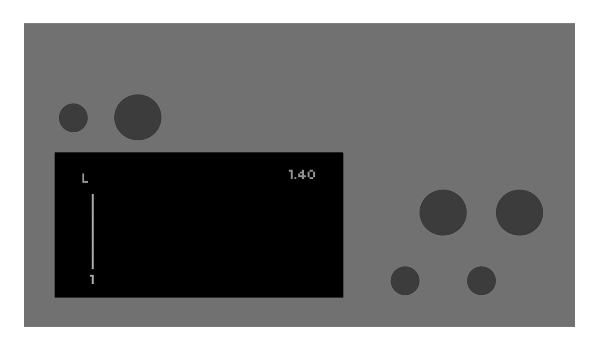
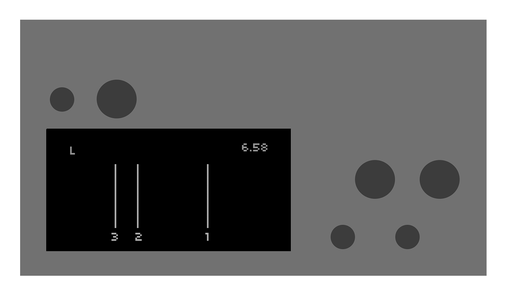
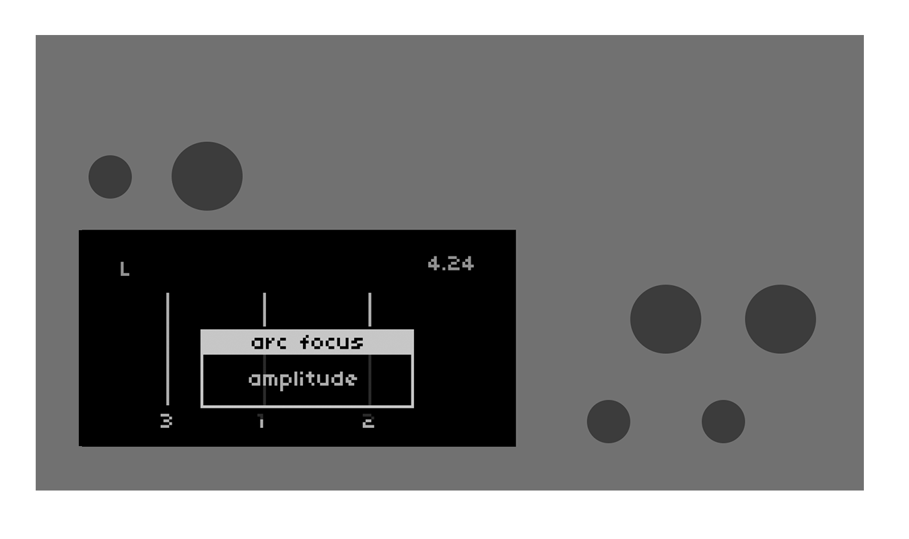
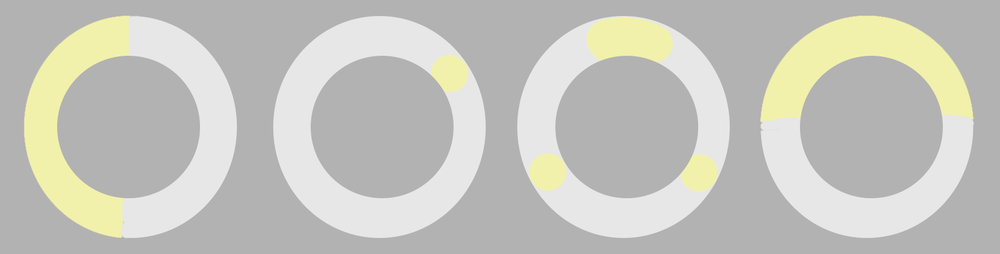
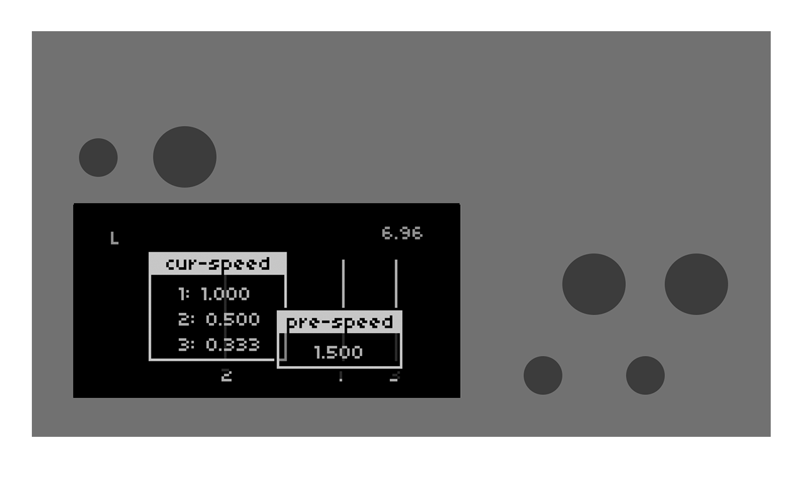
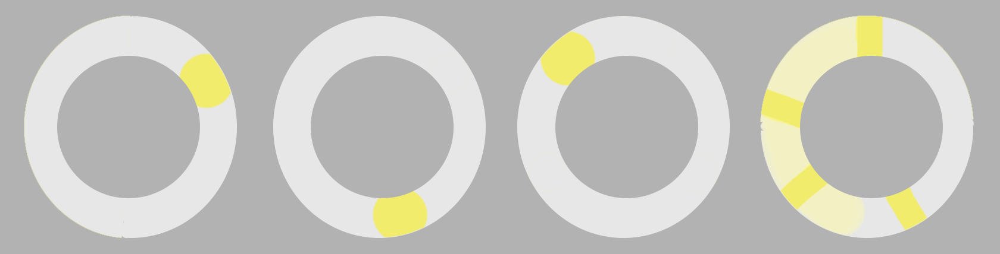
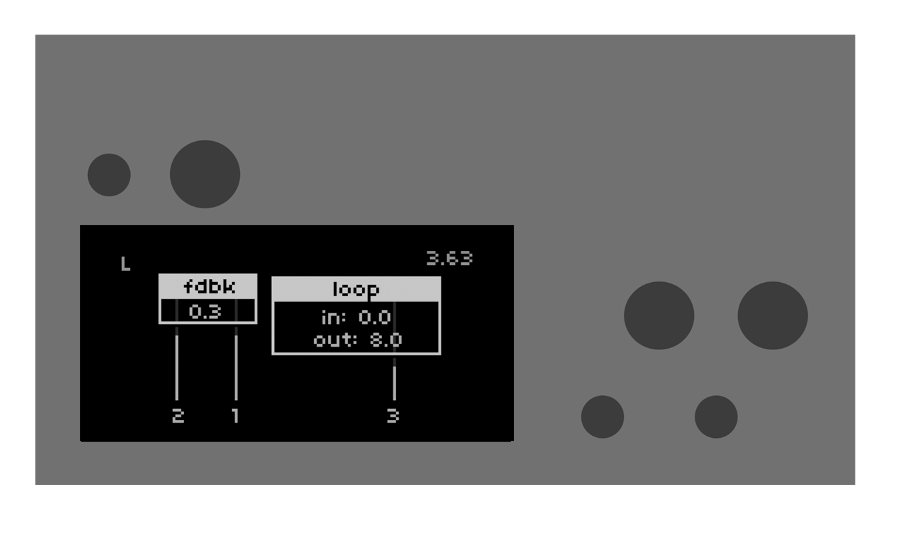

a norns looper script focused on arc control

---

  <h1>getting started</h1> 

when starting larc, you'll be looping a blank section of tape.

this is indicated by an **L** in the top left corner of your screen, and the absence of a waveform drawing. press **key 3** to toggle recording/looping. the counter in the top right corner tracks the record head position.

---

at this point, your arc will be focused on **amplitude**. turn arc ring 2 and 3 to bring up the amplitude of your 2nd and 3rd play heads, revealing them on the screen.

hold **key 1** and touch an arc ring to change the arc focus.

* ring 1 = amplitude
* ring 2 = speed
* ring 3 = panning
* ring 4 = filter cutoff

---

while **amplitude**, **panning**, and **cutoff** behave intuitively as knobs increasing or decreasing a value, **speed** is less intuitive.

first, use ring 4 to set a pre-speed value. then, move a ring 1 - 3 to set the play head speed. moving a ring counter-clockwise will set the play head to reverse.

---

press **key2** to toggle record head and loop settings.

* norns enc 1 = feedback
* norns enc 2 = loop start
* norns enc 3 = loop end
* norns key 1 + enc 1 = record speed
* arc ring 4 = loop/window shift

---
### to clear the buffer hold **key 1** and press **key 2**
---

# todo:

in no particular order...

* ~~lfo's~~
* screen/arc animation for shifting the loop window
* norns encoder controls for... everything

